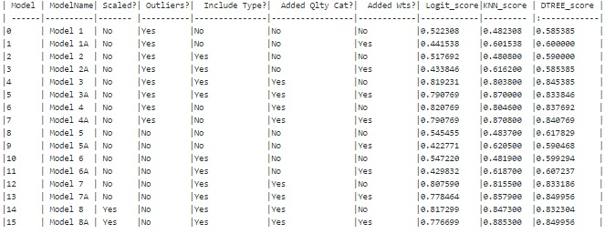

# Predicting the Quality of Wine

  

## INTRODUCTION
The goal is to predict quality of wine amongst the list of red and white wines using Logistic regression, KNN and Decision Tree. 
The dataset consists of the information about physicochemical tests on the different varieties of wines. 
Various variables present in the dataset includes data of fixed acidity, volatile acidity, citric acid, ph, alcohol etc. 
The dataset comprises of (red wine - 1599 observations; white wine - 4898 observations) with 12 columns. 
Below is a table showing names of all the columns and their description.

## DATA
| Column Name           | Description                                              |
| -------------         |-------------                                             | 
| fixed acidity         | Fixed acidity content                                    | 
| volatile acidity      | Volatile acidity content                                 |  
| citric acid           | citric acid content in ml                                | 
| residual sugar        | Residual sugar content                                   |   
| chlorides             | Chlorides content                                        |
| free sulfur dioxide   | Free sulphur dioxide content                             |
| total sulfur dioxide  | Total Sulphur dioxide content                            |
| density               | Density                                                  |
| pH                    | pH value                                                 |
| sulphates             | sulphate content                                         |
| alcohol               | alcohol content in ml                                    |
| quality               | Output Variable - score between 0 and 10                 |

## PROJECT ANALYSIS
| Description | Analysis |
| --- | --- |
| Red wine  |  |
| White wine |  |

##### Checking the confusion matrix first without new category for quality and then with 4 new category for quality(1-Poor, 2-Average, 3 – Good and 4 Excellent) and finally with 3 new category

  
   
  The accuracy increased when the quality was categorised into 3 new categories as Poor, Good and Excellent. 
  By looking at all the matrices, we can say that KNN and Logistic Regression has a higher chance in **correctly predicting all the new quality class correctly** 

### CONCLUSION

|     | Models Analysed |
| --- | ---             |
| Model Results                  |  |
| Model-Cross Validation Results |  |
| Model-Grid Search Results      |  |

#### Observation
##### Based on the data available we try the following approaches to see if the model built on these gives a good accuracy.
- Check a Model which doesnt includes type information, keep the outliers, doesnt scale data nor add any weights (due to imbalance data) and see if the KNN, Logistic Regression or Decision Tree provide good accuracy.
- Check if we add weights but ignore type, keep outliers and use unscaled data.
- Check if accuracy improves if we add type, remove outliers, scale data and add weights for predicting the quality 

After trying all the above it was observed that accuracy could not go beyond 61% even after adding type, removing outliers, standardised data to scale and adding weights. 

The approach is to see if we can bin the class "quality" from 0-10 to 3 major categories 0-2 [poor] ,3-6 [good] and 7-10 [excellent]. and see if the same Model is able to predict the class "quality" now more accurately.

##### For the new class (with 3 category) we found that by adding weights , standardised scale data ,including type the accuracy increased and the best was for KNN  88% for n = 16.

And, The best score for Logistic regression and Decision Tree was model 4 with 82% and Model 8A with 84% respectively.

##### Using cross validation with the new class (with 3 category) we found that accuracy increased to 96% for KNN , Random Forrest and Logistic Regression

 

And, Using Grid Search we found that to get the accuracy of 96% for KNN and Logistic Regression, we use KNN with parameters as n_estimator :1 6, p=2, algorithm=auto, metric=minkowski and weights=uniform.

 
#### Conclusion
##### KNN provides the highest accuracy of 96% with grid search and we use the best parameters as below:
-n_estimator :16
-p=2
-algorithm=auto
-metric=minkowski
-weights=uniform.

